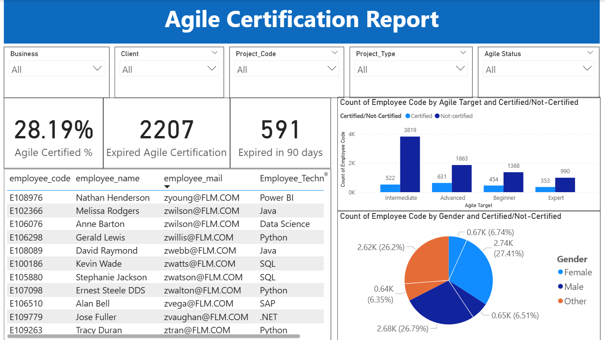
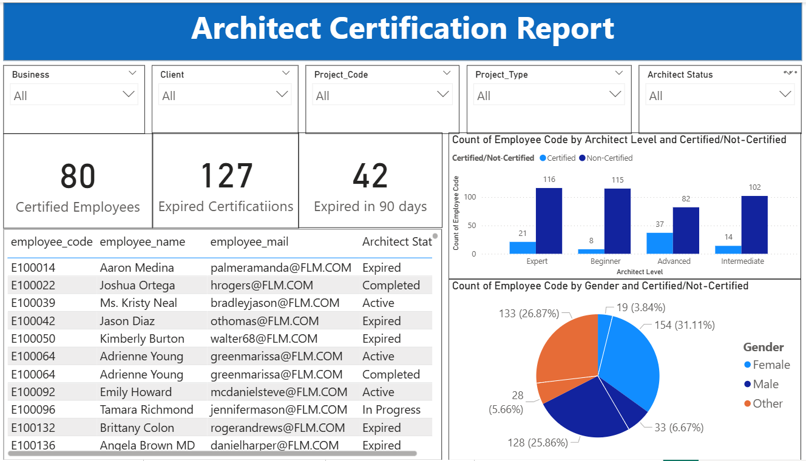
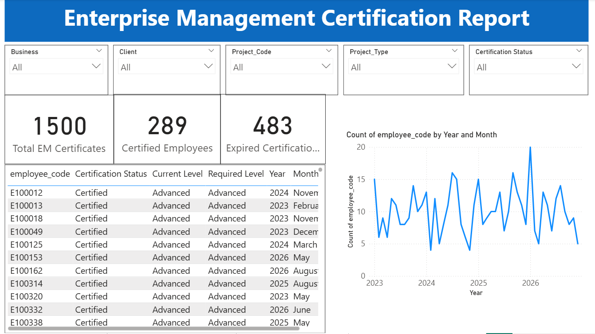
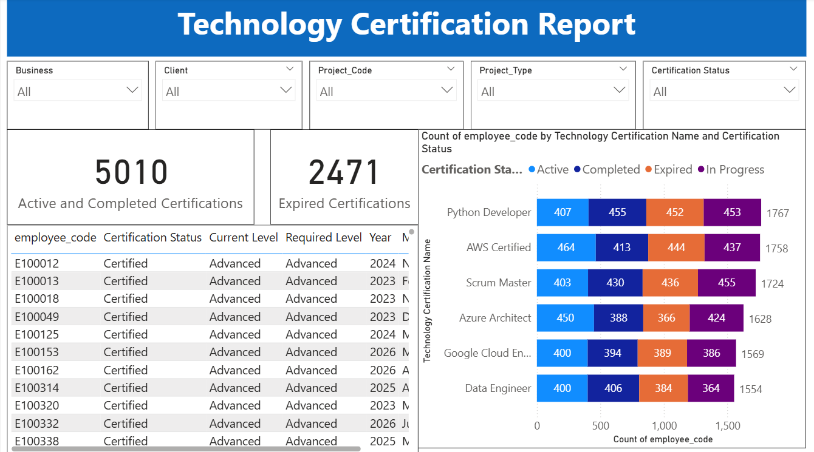

Employee Certification Analytics Dashboard using Power BI
# Power BI Certification Analytics Dashboard

## 📊 Project Overview

This project is an interactive **Power BI Certification Analytics Dashboard** designed to analyze employee certification status across different certification domains.

The dashboard covers:

* Agile Certification
* Architecture Certification
* Enterprise Management (EM) Certification
* Technology Certification

## 🎯 Project Objective

The objective of this project is to provide a centralized dashboard for tracking employee certification levels, certification status, expiry information, and technology-wise certification coverage.

## 🛠️ Tools & Technologies

* Microsoft Power BI
* DAX
* Power Query
* Data Visualization
* Data Modeling

## 📌 Dashboard Reports

### 1. Agile Certification Report

The Agile report provides an overview of employee Agile certifications.

**KPIs:**

* Percentage of employees certified in Agile
* Number of employees with expired Agile certifications
* Upcoming certification expiries within the next 90 days

**Visuals:**

* Certifications by level
* Certified vs Non-certified employees
* Certification analysis

**Certification Logic:**

An employee is considered certified when:

* Agile Level is greater than or equal to Agile Target
* Agile Status is `Completed`

### 2. Architecture Certification Report

The Architecture report tracks employee Architecture certifications.

**KPIs:**

* Total employees with valid Architecture certifications
* Number of expired or expiring certifications within 90 days

**Visuals:**

* Certifications by level
* Certified vs Non-certified employees

**Certification Logic:**

An employee is considered certified when:

* Architect Level is greater than or equal to Architect Target
* Architect Status is `Completed`

### 3. Enterprise Management (EM) Certification Report

The EM report focuses on Enterprise Management certifications.

**KPIs:**

* Number of employees holding EM certifications
* Certification expiry trend

**Visuals:**

* Monthly certification expiry trend
* Employee certification details table

The table contains:

* Employee Code
* Certification
* Expiry Date

### 4. Technology Certification Report

The Technology report analyzes employee certifications across different technology areas.

**Technologies include:**

* Cloud
* Data
* AI
* SAP
* Other technology areas

**KPI:**

* Number of employees certified per technology

**Visual:**

* Technology vs Certified Employees stacked bar chart

## 🔍 Filters & Slicers

The dashboard provides interactive filters for:

* Expiry Status
* Project Code
* Business
* Client
* Project Type

### Expiry Status

The dashboard supports the following certification statuses:

* Active
* Expired
* In Progress
* Completed

## 📈 Key Features

* Interactive Power BI dashboards
* Certification-level analysis
* Certified vs Non-certified analysis
* Certification expiry tracking
* Upcoming expiry identification
* Technology-wise certification analysis
* Interactive slicers and filters
* Monthly expiry trend analysis

## 📷 Dashboard Preview

Screenshots of the dashboard will be added here.

### Agile Certification Report



### Architecture Certification Report



### EM Certification Report



### Technology Certification Report



## 📂 Project Structure

```text
PowerBI-Certification-Analytics/
│
├── README.md
│
├── Certification Project.pbix
│
└── Screenshots/
    ├── Agile_Report.png
    ├── Architecture_Report.png
    ├── EM_Report.png
    └── Technology_Report.png
```

## 👨‍💻 Project Skills Demonstrated

* Power BI Dashboard Development
* Data Visualization
* DAX
* Power Query
* Data Modeling
* KPI Development
* Interactive Reporting
* Certification Analytics

## 📄 Project Requirements

The dashboard was developed based on the defined certification reporting requirements covering Agile, Architecture, Enterprise Management, and Technology certifications.

---

**Power BI Certification Analytics Dashboard | Data Analytics Project**
